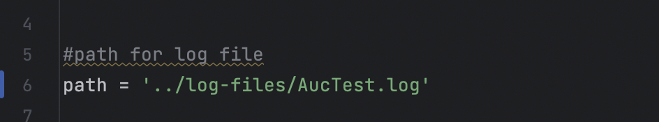
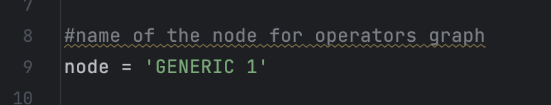
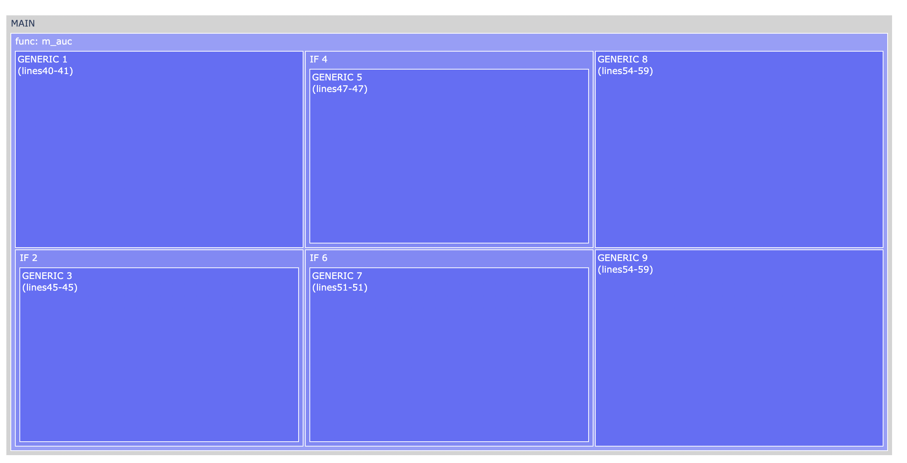
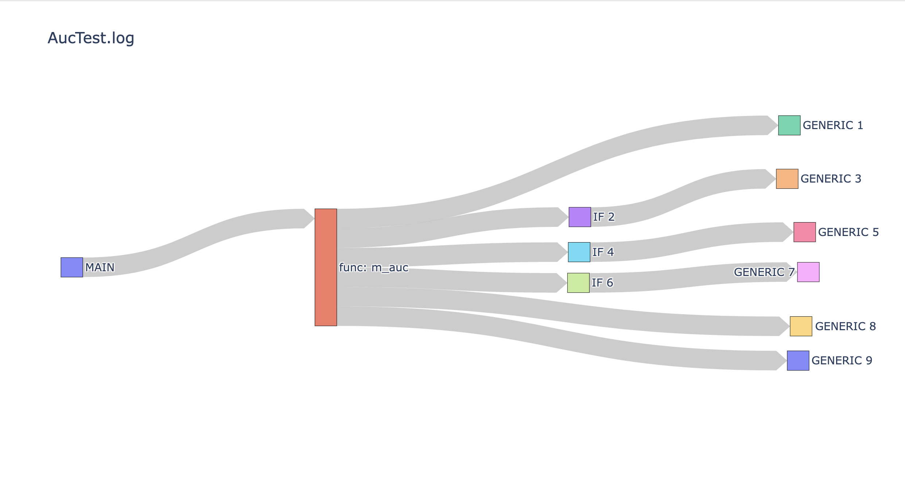
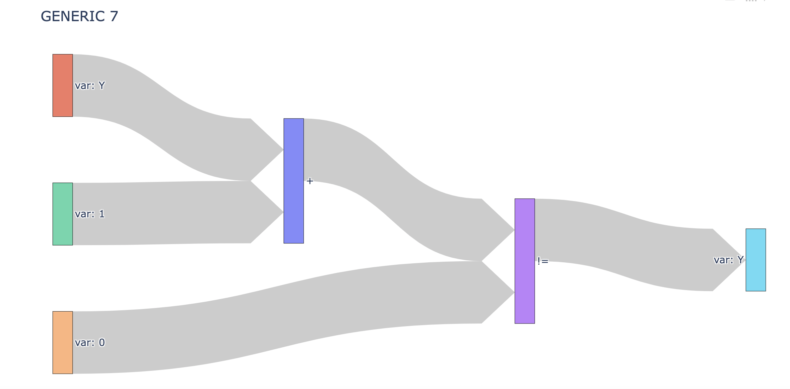

# DAG Visualizer For SystemDS

## About The Projects

DAG Visualizer for SystemDS  is a visualization tool designed to enhance understanding of execution plans  in SystemDS. This tool implements clear  representation of how machine learning algorithms are executed  making it easier  to optimize implementation.

Data scientist often use high-level programming languages to develop machine learning algorithms, which work for small sets of data. SystemDS optimizes and scales these algorithms to large sets set of data, that requires a low-level, complex implementation, making it easier to deal with large sets of data.

As a result of this process, SystemDS detailed execution plains in plain text form.Understanding these execution plans is crucial to identify performance issues. However, comprehending these plans can be challenging and time consuming in plain text form.

This issue led to creation of DAG Visualizer for SystemDS.

## Getting Started
<ul>
  <li>Begin by cloning this repository to your local machine.</li>
  <li>Install plotly </li>
  <li>Configure the log path in "main.py" to ensure that the Parse Module can retrieve execution plans correctly.</li>
</ul>

<ul>
  <li>Specify the name of the node in "main.py" for operations graph
</ul>

## Example Visualization
As a demonstration, we will use the  BuiltinAucTest. After passing the path of the log file containing the execution plan, the program will generate 3 graphs 

 The first graph is Treemap, an interactive blocks graph. 

 The second graph is a sankey diagram, a flow diagram.

 The last graph is another sankey diagram, that contains the operations executing in the specified node.

### Future Improvements:

- At the moment we don't support sourcing from other files function.
- Please make sure to pass one execution plan at a time 
