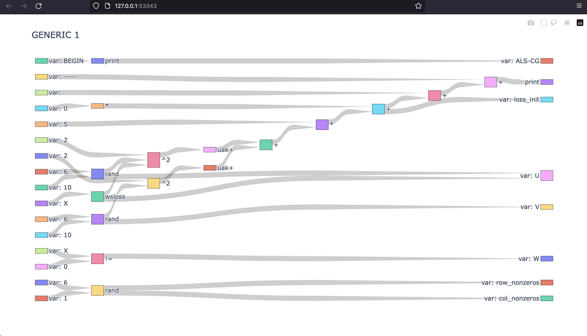

# DAG Visualizer For SystemDS

## About Repository

In this repository, we implemented a visualizer to visualize the execution plans of a Apache SystemDS script. The programm takes an execution plan log created by Apache SystemDS as an input and creates various graphs as an output. 

Repository's contributers are Begum Cajias and Barkin Karadeniz.

## Motivation

Apache SystemDS compiles a high-level script into hybrid execution plans of local, distributed and GPU operations. Understanding these plans is absolutely necessary to implement features in
the compilation and runtime stacks. So this project is developed, aiming to produce visual structures for the execution plans of high-level scripts compiled by Apache SystemDS.

## SystemDS

### Apache's Definition:
SystemDS is an open source ML system for the end-to-end data science lifecycle from data integration, cleaning, and feature engineering, over efficient, local and distributed ML model training, to deployment and serving. To this end, it provides a stack of declarative languages with R-like syntax for (1) the different tasks of the data-science lifecycle, and (2) users with different expertise. These high-level scripts are compiled into hybrid execution plans of local, in-memory CPU and GPU operations, as well as distributed operations on Apache Spark.

## How to Use

If you run an Apache SystemDS script with an additional "-explain" argument, you would see that Apache SystemDS printed an detailed execution plan to your debug console. You have to take that log and add that log to "log-files" on your clone of this repository as a file. Then go to "src/main.py" and change the "path" variable on line 4 accordingly.

If you know the "Generic Block" that you would like to inspect already, you can alter the variable "node" on line 7 accordingly. If you don't, you can leave the assigned value as "GENERIC 1" since any instance we tested already had a node named "GENERIC 1".

This would create 2 visuals. An example is shown below for "decisionTree.log".

After receiving the visuals, you can change the "node" variable however you need or want.

## Limitations

### You should be aware of the following limitations:
- Your log file has to include only one execution plan. For example, if your log file has several 
# EXPLAIN (RUNTIME): 
 as a line that means that your log file has several execution plans bundled together. A known exception is "<a href="https://github.com/apache/systemds/blob/main/src/test/java/org/apache/sysds/test/functions/builtin/part1/BuiltinArimaTest.java">BuiltinArimaTest.java</a>" from Apache SystemDS's original<a href="https://github.com/apache/systemds"> open source repository</a>.
- Your log file shouldn't have called a function from a 3rd party library or file. A known example of this is "<a href="https://github.com/apache/systemds/blob/main/src/test/java/org/apache/sysds/test/functions/builtin/part1/BuiltinBayesianOptimisationTest.java">BuiltinBayesianOptimisationTest.java</a>" from Apache SystemDS's original<a href="https://github.com/apache/systemds"> open source repository</a>.